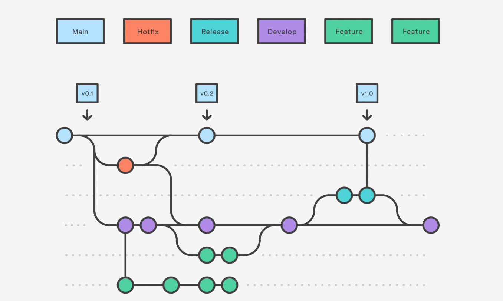

# Contributing to adr-viewer

First of all, thanks for contributing!

This is an evolving document which details what's needed to build and deploy `adr-viewer`.
Some tasks are only for maintainers, and some are for contributors.

Tasks and information for maintainers are depicted by :large_orange_diamond:
Tasks and information for contributors are depicted by :large_blue_diamond:

## Contribution Model :large_blue_diamond:

adr-viewer uses the "Gitflow" model (as show in the diagram below). This means that contributors can be working on different branches and features simultaneously, whilst still knowing that there is a path toward production for their contributions, be they code or documentation.

Note that for this model to function correctly, branches must be named accordingly, since the build infrastructure uses these names to determine what to build, and (in some cases) what to deploy and where.

**Branch names**
| Name | Description | Responsibility |
|-----|-----|:--:|
| main | This branch contains the code which is currently in production and therefore deployed to PyPI, and which will be cloned for users to use |  :large_orange_diamond: |
| hotfix | A hotfix branch is created when a major bug is detected and needs a fix to the production code immediately|:large_orange_diamond: :large_blue_diamond:|
| release | A release branch is taken when a stable codebase is about to be deployed to production. It must be stable and no further changes can be made to it post-release |:large_orange_diamond: |
|develop| This branch "collects" all the PRs that have been successfully merged, ready for a release to be cut when ready|:large_orange_diamond: |
|feature| Feature branches are where new functionality is developed, bug fixes and general updates are carried out prior to being tested and merged into the develop branch|:large_blue_diamond: |

**Pushing and Building
