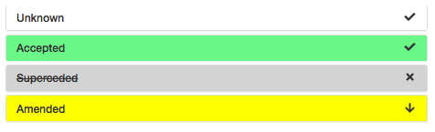

# adr-viewer

[](https://travis-ci.org/mrwilson/adr-viewer)

Show off your Architecture Decision Records with an easy-to-navigate web page, either as a local web-server or generated static content.

## Examples


* Example above using Nat Pryce's [adr-tools](https://github.com/npryce/adr-tools) project
* This project exposes its own Architecture Decision Records [here](https://mrwilson.github.io/adr-viewer/index.html)

## Installation

### From PyPI

```bash
$ pip install adr-viewer
```

### From local build

adr-viewer requires Python 2.7 (with Pip)

```bash
$ git clone https://github.com/mrwilson/adr-viewer
$ pip install -r requirements.txt
$ python setup.py install
```

## Usage

```bash
Usage: adr-viewer [OPTIONS]

Options:
  --adr-path TEXT  Directory containing ADR files.  [default: doc/adr/]
  --output TEXT    File to write output to.  [default: index.html]
  --serve          Serve content at http://localhost:8000/
  --help           Show this message and exit.
```

The default for `--adr-path` is `doc/adr/` because this is the default path generated by `adr-tools`.

## Supported Record Types


