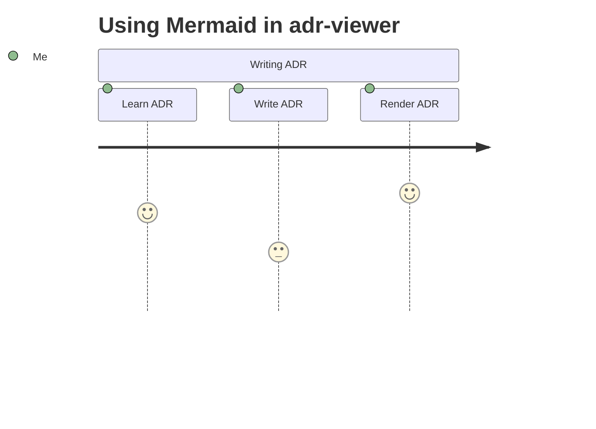
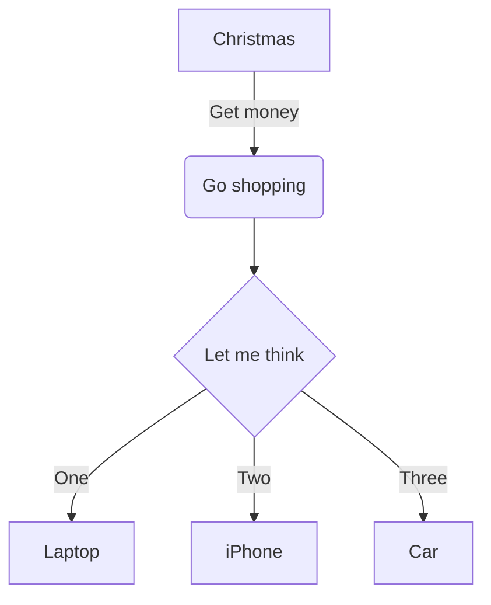
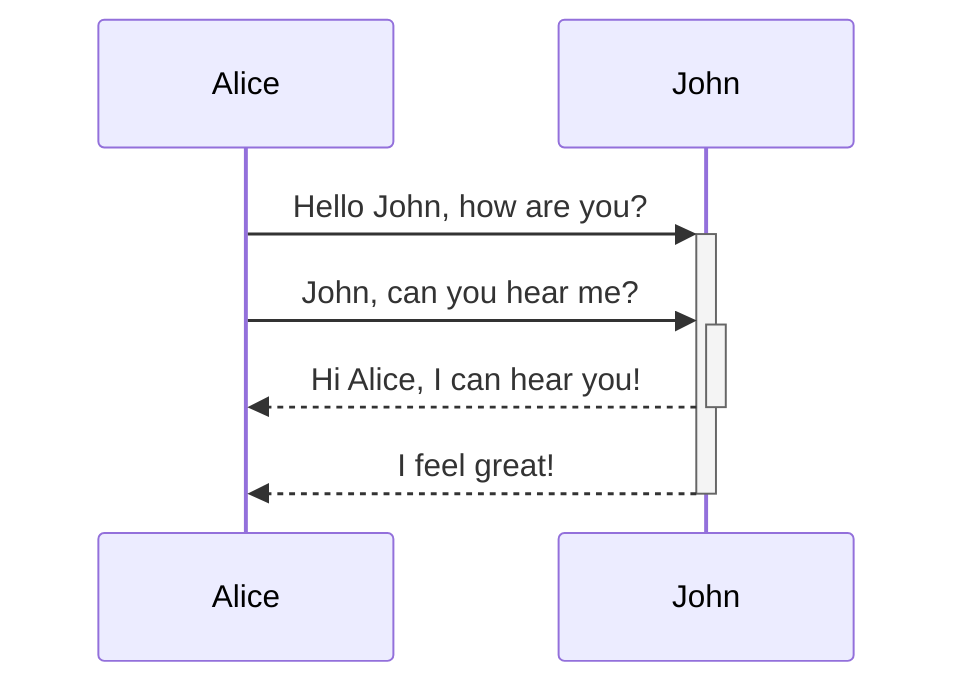
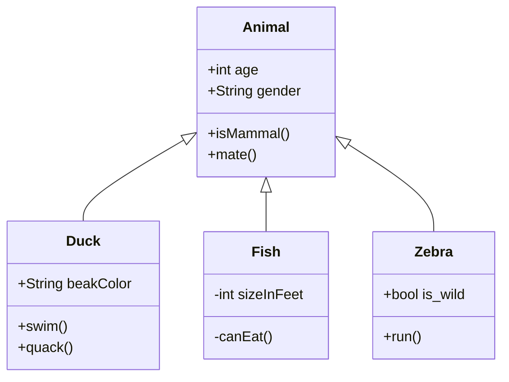
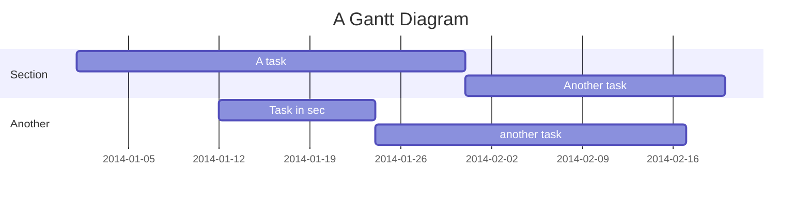

# 2. Use mermaid for diagrams

Date: 2023-09-02

## Status

Accepted

## Context

We need to be able to diagram things.

## Decision

We will use [Mermaid](https://mermaid.js.org).

## Consequences

We need to add a Mermaid script in the `head` tag of the template, potentially only when there is a Mermaid block in a Markdown document.

